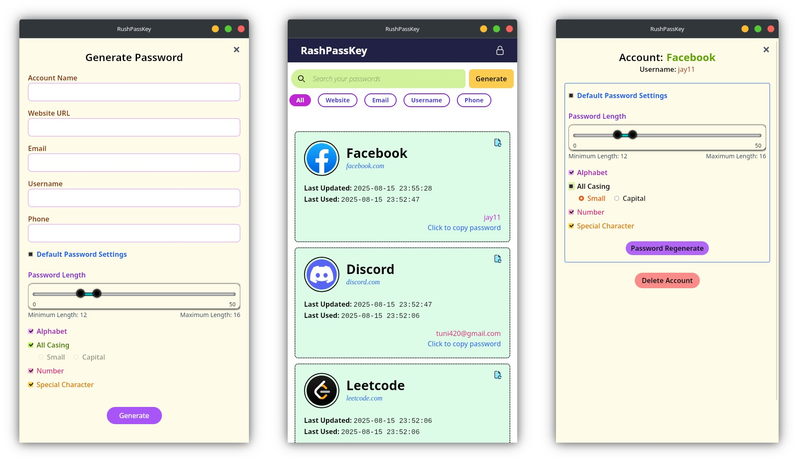

<div align='center'><h1>RushPassKey 🦀</h1></div>

<div align="center"></div>


## 🚀 Introduction

**RushPassKey** is a modern, secure, and user-friendly password manager that prioritizes privacy and cross-platform compatibility. Built with Rust for the backend and React for the frontend, it leverages Tauri to create a native desktop application that runs on Windows, macOS, Linux, Android, and iOS.

### ✨ Key Features

- 🔐 **Secure Password Generation** - Advanced algorithms for creating strong, unique passwords
- 🗄️ **Local Storage** - All data is encrypted and stored locally on your device
- 🌐 **Cross-Platform** - Works seamlessly across all major operating systems
- 🔒 **End-to-End Encryption** - Military-grade encryption for your sensitive data
- 📱 **Modern UI/UX** - Clean, intuitive interface built with React and Tailwind CSS
- ⚡ **Performance** - Rust backend ensures fast and efficient operations
- 🔄 **Password Regeneration** - Easily regenerate passwords while maintaining security

---

## 🛠️ Technology Stack

### Backend (Rust)

- **Tauri 2.0** - Cross-platform desktop app framework
- **SQLite** - Local database for secure data storage
- **AES-256** - Military-grade encryption algorithms
- **Cross-platform APIs** - Native system integration

### Frontend (React)

- **React 18** - Modern UI framework
- **TypeScript** - Type-safe development
- **Tailwind CSS** - Utility-first CSS framework
- **Vite** - Fast build tool and dev server

### Security Features

- **Machine-specific encryption** - Unique identifiers for each device
- **Password hashing** - Secure storage of credentials
- **Local-only storage** - No cloud dependencies
- **Encrypted database** - All data is encrypted at rest

---

## 📋 Prerequisites

Before you begin, ensure you have the following installed:

- **Node.js** (v18 or higher)
- **Rust** (latest stable version)
- **Platform-specific tools**:
  - **Windows**: Visual Studio Build Tools
  - **macOS**: Xcode Command Line Tools
  - **Linux**: Build essentials, libssl-dev
  - **Android**: Android SDK, NDK
  - **iOS**: Xcode, iOS SDK

---

## 🚀 Quick Start

### 1. Clone the Repository

```bash
git clone https://github.com/jay-neo/RushPassKey.git
cd RushPassKey
```

### 2. Install Dependencies

```bash
npm install
```

### 3. Run Development Server

```bash
npm run tauri dev
```

### 4. Build for Production

```bash
npm run tauri build
```

---

## 🏗️ Project Structure

```
RushPassKey/
├── src/                    # React frontend source
│   ├── components/        # Reusable UI components
│   ├── views/            # Main application views
│   ├── lib/              # Frontend utilities and contexts
│   └── main.tsx          # Application entry point
├── src-tauri/            # Rust backend source
│   ├── src/              # Rust source code
│   │   ├── commands/     # Tauri command handlers
│   │   ├── db/           # Database operations
│   │   ├── security/     # Encryption and security
│   │   └── utils/        # Utility functions
│   ├── Cargo.toml        # Rust dependencies
│   └── tauri.conf.json   # Tauri configuration
├── assets/               # Static assets
├── docs/                 # Documentation
└── public/               # Public assets
```

---

## 🔧 Configuration

### Tauri Configuration

The main configuration file is located at `src-tauri/tauri.conf.json`. Key settings include:

- **App metadata** (name, version, description)
- **Security policies** and capabilities
- **Build settings** for different platforms
- **Window configuration** and styling


---

## 🚀 Development

### Available Scripts

```bash
# Development
npm run dev              # Start Vite dev server
npm run tauri dev        # Start Tauri development

# Building
npm run build           # Build React app
npm run tauri build     # Build Tauri app

# Preview
npm run preview         # Preview production build
```

### Development Workflow

1. **Frontend Changes**: Edit React components in `src/`
2. **Backend Changes**: Modify Rust code in `src-tauri/src/`
3. **Hot Reload**: Changes automatically reflect in development
4. **Testing**: Run tests with `cargo test` in `src-tauri/`

---

## 🔐 Security Architecture

### Encryption Flow

1. **Machine Identification**: Unique device identifier generation
2. **Key Derivation**: Password-based key derivation (PBKDF2)
3. **Data Encryption**: AES-256 encryption for all sensitive data
4. **Secure Storage**: Encrypted storage using file system

### Machine Identifiers

- **Linux**: `/etc/machine-id` file
- **macOS**: Hardware UUID via `ioreg`
- **Windows**: BIOS serial number via `wmic`
- **Android**: Device properties and settings database
- **iOS**: System properties via `sysctl`

---

## 📱 Platform Support

| Platform | Status  | Notes                        |
| -------- | ------- | ---------------------------- |
| Windows  | ✅ Full | Native Windows application   |
| macOS    | ✅ Full | Universal binary support     |
| Linux    | ✅ Full | AppImage and package support |
| Android  | 🚧 Beta | Mobile-optimized interface   |
| iOS      | 🚧 Beta | iOS-specific optimizations   |

---

## 🤝 Contributing

We welcome contributions! Please see our [Contributing Guidelines](CONTRIBUTING.md) for details.

### Development Setup

1. Fork the repository
2. Create a feature branch
3. Make your changes
4. Add tests if applicable
5. Submit a pull request

### Code Style

- **Rust**: Follow Rust formatting guidelines (`cargo fmt`)
- **React**: Use TypeScript and follow React best practices
- **CSS**: Use Tailwind CSS utility classes

---

## 📄 License

This project is licensed under the MIT License - see the [LICENSE](LICENSE) file for details.

---

## 📞 Support

- **Issues**: [GitHub Issues](https://github.com/yourusername/RushPassKey/issues)
- **Discussions**: [GitHub Discussions](https://github.com/yourusername/RushPassKey/discussions)
- **Email**: jay-neo@outlook.com

---

<div align="center">

**Made with ❤️ by [jay-neo](https://jay-neo.github.io)**

</div>
