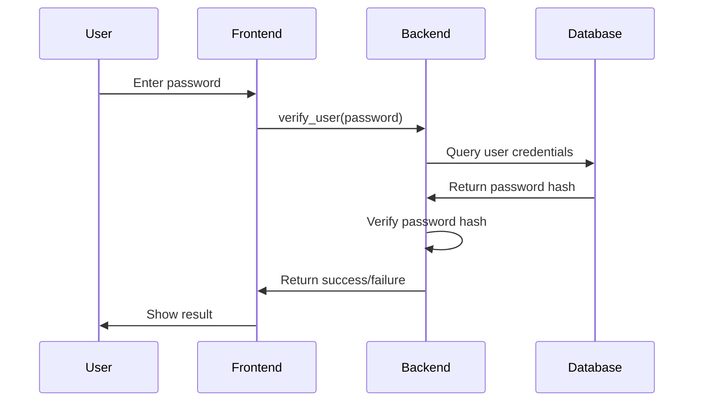

# Security Documentation

## Overview

RushPassKey implements a comprehensive security architecture designed to protect user data while maintaining usability. This document outlines the security measures, encryption protocols, and best practices implemented in the application.

---

## Security Architecture

### 1. Multi-Layer Security Model

```
┌─────────────────────────────────────────────────────────────┐
│                    User Interface Layer                     │
├─────────────────────────────────────────────────────────────┤
│                   Authentication Layer                      │
├─────────────────────────────────────────────────────────────┤
│                    Encryption Layer                         │
├─────────────────────────────────────────────────────────────┤
│                    Storage Layer                            │
└─────────────────────────────────────────────────────────────┘
```

### 2. Security Principles

- **Defense in Depth**: Multiple security layers
- **Principle of Least Privilege**: Minimal required permissions
- **Zero Trust**: Verify everything, trust nothing
- **Secure by Default**: Security features enabled by default

---

## Authentication & Authorization

### User Authentication

#### Password Requirements
- **Minimum Length**: 12 characters
- **Complexity**: Must include uppercase, lowercase, numbers, and symbols
- **Entropy**: Minimum 80 bits of entropy
- **Validation**: Real-time strength checking

#### Authentication Flow


#### Session Management
- **Session Duration**: Configurable timeout (default: 30 minutes)
- **Session Storage**: Encrypted local storage
- **Auto-logout**: Automatic logout on inactivity
- **Session Invalidation**: Clear sessions on password change

### Multi-Factor Authentication (Future)

- **TOTP Support**: Time-based one-time passwords
- **Hardware Keys**: FIDO2/U2F support
- **Biometric**: Platform-specific biometric authentication

---

## Encryption Implementation

### 1. Key Derivation

#### PBKDF2 Implementation
```rust
use argon2::{self, Config};

pub fn derive_key(password: &str, salt: &[u8]) -> Result<[u8; 32], Box<dyn Error>> {
    let config = Config {
        variant: argon2::Variant::Argon2id,
        version: argon2::Version::Version13,
        mem_cost: 65536,      // 64 MB
        time_cost: 4,         // 4 iterations
        lanes: 4,             // 4 parallel lanes
        ..Default::default()
    };
    
    let hash = argon2::hash_encoded(password.as_bytes(), salt, &config)?;
    let mut key = [0u8; 32];
    key.copy_from_slice(&hash[..32]);
    Ok(key)
}
```

#### Salt Generation
- **Source**: Cryptographically secure random number generator
- **Length**: 32 bytes (256 bits)
- **Uniqueness**: Per-user, per-device salts
- **Storage**: Encrypted alongside encrypted data

### 2. Data Encryption

#### AES-256-GCM Implementation
```rust
use aes_gcm::{Aes256Gcm, Key, Nonce};
use aes_gcm::aead::{Aead, NewAead};

pub fn encrypt_data(data: &[u8], key: &[u8; 32]) -> Result<Vec<u8>, Box<dyn Error>> {
    let cipher = Aes256Gcm::new(Key::from_slice(key));
    let nonce = Nonce::from_slice(b"unique nonce"); // In production, generate random nonce
    
    let ciphertext = cipher
        .encrypt(nonce, data)
        .map_err(|e| format!("Encryption failed: {}", e))?;
    
    Ok(ciphertext)
}
```

#### Encryption Parameters
- **Algorithm**: AES-256-GCM
- **Key Size**: 256 bits
- **Nonce Size**: 96 bits (12 bytes)
- **Tag Size**: 128 bits (16 bytes)
- **Mode**: Authenticated encryption with associated data

### 3. Machine-Specific Encryption

#### Device Fingerprinting
```rust
#[cfg(target_os = "linux")]
pub fn get_machine_identifier() -> String {
    let machine_id = std::fs::read_to_string("/etc/machine-id")
        .expect("Failed to read machine-id");
    machine_id.trim().to_string()
}

#[cfg(target_os = "macos")]
pub fn get_machine_identifier() -> String {
    let output = std::process::Command::new("ioreg")
        .arg("-rd1")
        .arg("-c")
        .arg("IOPlatformExpertDevice")
        .output()
        .expect("Failed to get hardware UUID");
    
    // Parse and extract UUID
    // ... implementation details
}
```

#### Cross-Platform Support
- **Linux**: `/etc/machine-id` file
- **macOS**: Hardware UUID via `ioreg`
- **Windows**: BIOS serial number via `wmic`
- **Android**: Device properties + settings database
- **iOS**: System properties via `sysctl`

---

## Threat Model

### 1. Identified Threats

#### Physical Access
- **Threat**: Unauthorized physical access to device
- **Mitigation**: Full disk encryption, secure boot
- **Risk Level**: Medium

#### Malware
- **Threat**: Keyloggers, screen capture malware
- **Mitigation**: Anti-malware integration, secure input
- **Risk Level**: High

#### Network Attacks
- **Threat**: Man-in-the-middle, network sniffing
- **Mitigation**: Local-only storage, no network communication
- **Risk Level**: Low

#### Social Engineering
- **Threat**: Phishing, social manipulation
- **Mitigation**: User education, security warnings
- **Risk Level**: Medium

### 2. Attack Vectors

#### Brute Force Attacks
- **Protection**: Rate limiting, account lockout
- **Implementation**: Exponential backoff, CAPTCHA
- **Monitoring**: Failed login attempt tracking

#### Dictionary Attacks
- **Protection**: Strong password requirements
- **Implementation**: Password strength validation
- **Monitoring**: Common password detection

#### Side-Channel Attacks
- **Protection**: Constant-time operations
- **Implementation**: Timing attack prevention
- **Monitoring**: Performance analysis

---

## Security Best Practices

### 1. Development Security

#### Code Security
- **Static Analysis**: Use tools like `cargo audit`
- **Code Review**: All security-related code reviewed
- **Dependency Scanning**: Regular vulnerability scanning
- **Secure Coding**: Follow OWASP guidelines

#### Testing Security
```rust
#[cfg(test)]
mod tests {
    use super::*;
    
    #[test]
    fn test_password_validation() {
        let weak_password = "password123";
        assert!(!is_password_strong(weak_password));
        
        let strong_password = "K9#mP2$vL8@nQ5";
        assert!(is_password_strong(strong_password));
    }
    
    #[test]
    fn test_encryption_roundtrip() {
        let data = b"sensitive data";
        let key = generate_random_key();
        
        let encrypted = encrypt_data(data, &key).unwrap();
        let decrypted = decrypt_data(&encrypted, &key).unwrap();
        
        assert_eq!(data, decrypted.as_slice());
    }
}
```

### 2. Runtime Security

#### Input Validation
- **Sanitization**: All user input sanitized
- **Validation**: Input format and content validation
- **Escaping**: Proper escaping for output
- **Bounds Checking**: Array and buffer bounds validation

#### Error Handling
- **Secure Errors**: No sensitive information in error messages
- **Logging**: Secure logging without sensitive data
- **Graceful Degradation**: Fail securely on errors
- **User Feedback**: Appropriate user feedback

---


## Compliance & Standards

### 1. Security Standards

#### OWASP Top 10
- **A01:2021** - Broken Access Control
- **A02:2021** - Cryptographic Failures
- **A03:2021** - Injection
- **A04:2021** - Insecure Design
- **A05:2021** - Security Misconfiguration

#### NIST Cybersecurity Framework
- **Identify**: Asset management, risk assessment
- **Protect**: Access control, data security
- **Detect**: Continuous monitoring, anomaly detection
- **Respond**: Incident response, communications
- **Recover**: Recovery planning, improvements

### 2. Privacy Regulations

#### GDPR Compliance
- **Data Minimization**: Collect only necessary data
- **User Consent**: Clear consent mechanisms
- **Data Portability**: Export user data
- **Right to Erasure**: Delete user data on request

#### CCPA Compliance
- **Data Disclosure**: Inform users about data collection
- **Opt-out Rights**: Allow users to opt out
- **Data Deletion**: Delete data on request
- **Non-discrimination**: Equal service regardless of privacy choices

---

## Security Roadmap

### 1. Short-term Goals (3-6 months)

- **Enhanced Password Policies**: Implement advanced password requirements
- **Audit Logging**: Comprehensive security event logging
- **Input Validation**: Enhanced input sanitization
- **Error Handling**: Improved secure error handling

### 2. Medium-term Goals (6-12 months)

- **Multi-Factor Authentication**: TOTP and hardware key support
- **Advanced Encryption**: Post-quantum cryptography preparation
- **Security Monitoring**: Real-time threat detection
- **Penetration Testing**: Regular security assessments

### 3. Long-term Goals (1-2 years)

- **Zero-Knowledge Architecture**: Advanced privacy features
- **Blockchain Integration**: Decentralized identity management
- **AI Security**: Machine learning threat detection
- **Quantum Security**: Post-quantum cryptography implementation

---

## Conclusion

RushPassKey implements a comprehensive security architecture designed to protect user data against various threats. The multi-layered approach, combined with industry best practices and continuous monitoring, provides robust security while maintaining usability.

### Key Security Features

- **End-to-end encryption** with AES-256-GCM
- **Machine-specific encryption** for device binding
- **Strong authentication** with Argon2id hashing
- **Comprehensive audit logging** for security monitoring
- **Regular security updates** and vulnerability management

### Security Commitment

We are committed to maintaining the highest security standards and continuously improving our security posture. Regular security audits, penetration testing, and community feedback help us identify and address potential vulnerabilities.

---

*For security-related questions or vulnerability reports, please contact: jay-neo@outlook.com*

*Last updated: December 2024*
